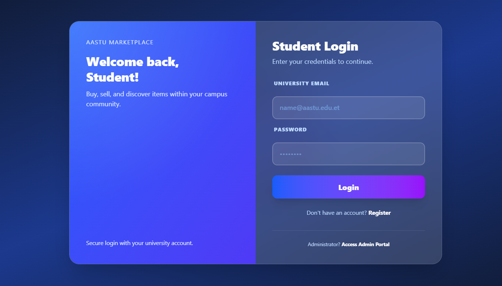
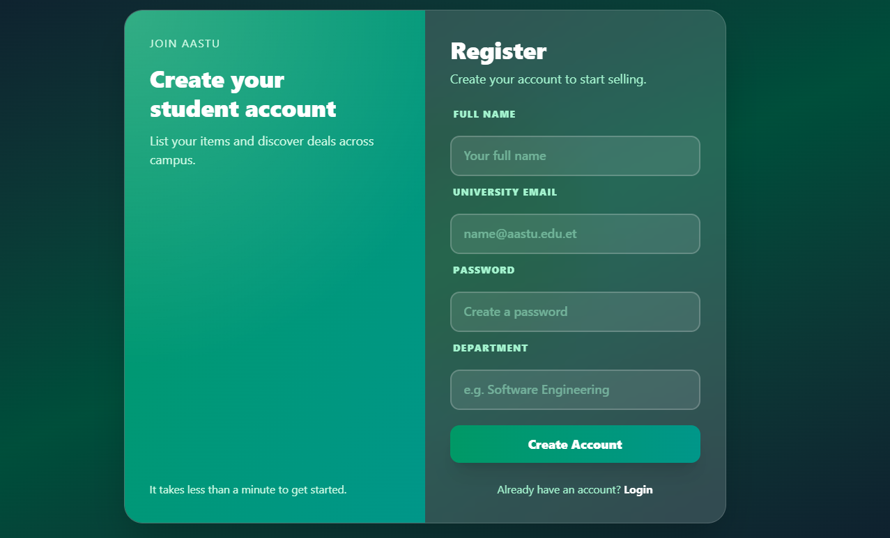
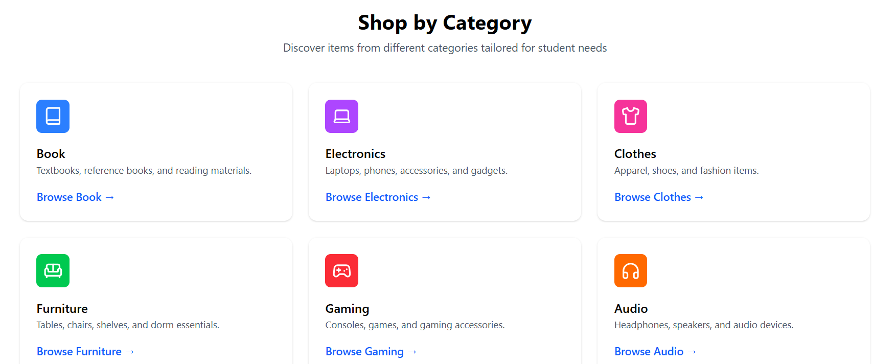
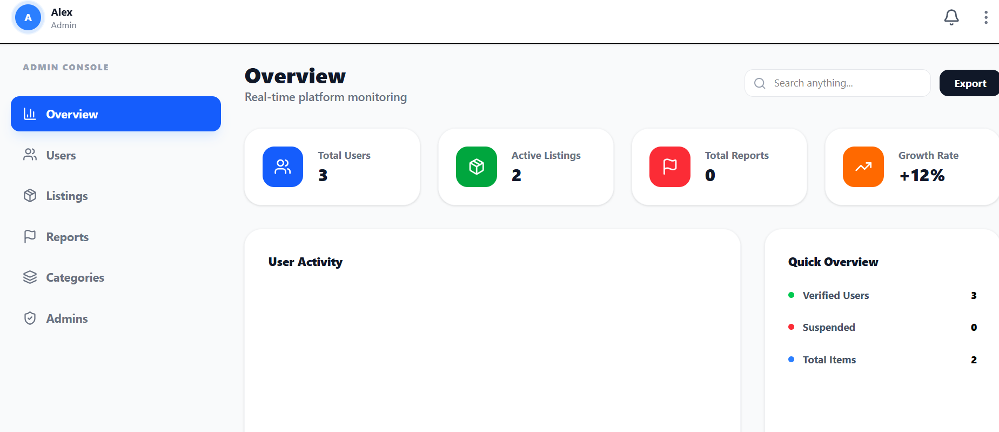
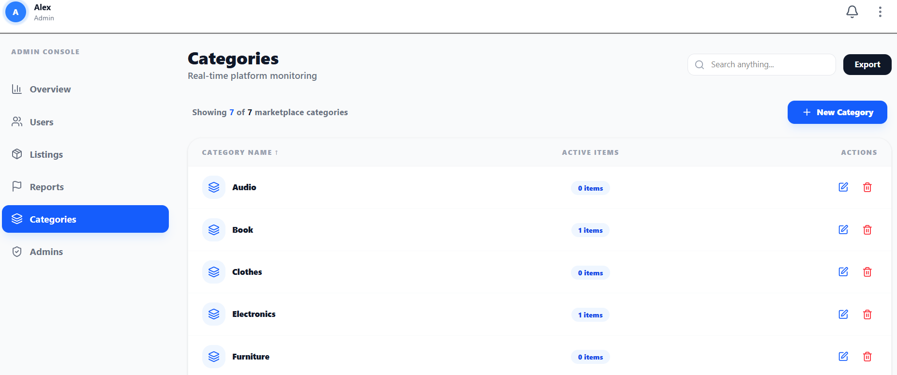

# AASTU Online Shopping Platform

A full‑stack marketplace platform for students to list items, discover products, and chat in real time. The project includes a NestJS backend (REST + WebSocket) and a React + Vite frontend with Tailwind styling.

## Features

- Authentication and role-based access (admin & student)
- Item listings with categories
- Search and browsing UI
- Real-time chat with typing, read receipts, reactions, attachments
- Favorites and reports
- Admin dashboard for user, item, category, and report management

## Tech Stack

**Frontend**
- React 19 + Vite
- Tailwind CSS
- Axios
- Socket.IO client

**Backend**
- NestJS
- MongoDB + Mongoose
- JWT authentication
- Socket.IO (chat)
- Cloudinary (media uploads)

## Project Structure

- backend/ – NestJS API + WebSocket server
- frontend/ – React client (Vite)
- DEPLOYMENT.md – deployment notes

## Screenshots

- **Login** – Secure sign-in for students and admins.
   
- **Register** – Account creation with student details.
   
- **Category** – Browse items by category with clean cards.
   
- **Admin Dashboard** – High-level admin overview and management shortcuts.
   
- **Admin Categories** – Manage and maintain the category catalog.
   

## Prerequisites

- Node.js 18+ (recommended)
- MongoDB instance (local or cloud)
- Cloudinary account (for media uploads)

## Environment Variables

### Backend

Create backend/.env based on backend/.env.production.example:

- MONGODB_URI
- JWT_SECRET
- CLOUDINARY_CLOUD_NAME
- CLOUDINARY_API_KEY
- CLOUDINARY_API_SECRET
- PORT (optional)
- CORS_ORIGIN

### Frontend

Create frontend/.env (already present locally) or use frontend/.env.production.example:

- VITE_NEST_APP_URL (backend base URL)

## Installation

### Backend

1. Install dependencies:
   - npm install
2. Run the API:
   - npm run start:dev

### Frontend

1. Install dependencies:
   - npm install
2. Run the client:
   - npm run dev

## Build

### Backend

- npm run build
- npm run start:prod

### Frontend

- npm run build
- npm run preview

## Deployment

See DEPLOYMENT.md for production guidance.

## License

This project is provided for educational and portfolio purposes.